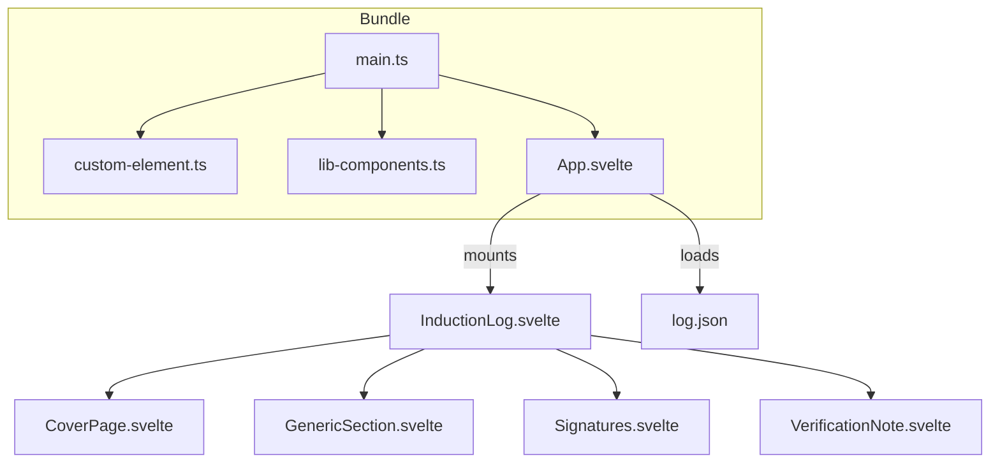
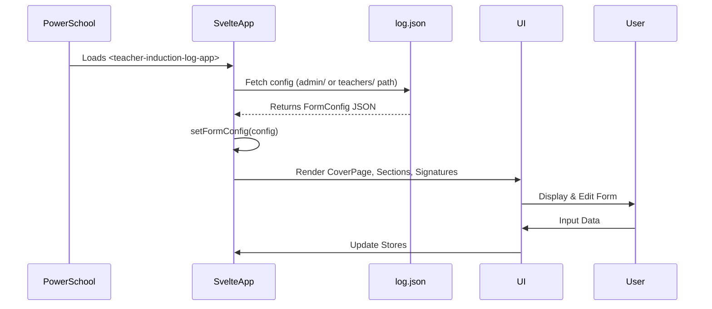

# Teacher Induction Log Plugin - Architecture & PowerSchool Integration

---

## PowerSchool Page Embedding

```mermaid
flowchart TD
    subgraph PowerSchool_Page
        A[~[wc:commonscripts]] --> B[~[wc:admin_header_frame_css]]
        B --> C[Breadcrumbs + Navigation]
        C --> D[~[wc:admin_navigation_frame_css]]
        D --> E[<teacher-induction-log-app>]
        E --> F[~[wc:admin_footer_frame_css]]
    end

    subgraph Svelte_App
        E --> G[teacher-induction-log-app (Custom Element)]
    end
```

- The plugin is embedded as `<teacher-induction-log-app>` inside a PowerSchool admin page.
- PowerSchool UI chrome is injected via `~[wc:*]` tags.
- **No `~[tlist_sql]` or `~(gpv.)` tags** are used in this plugin.

---

## Svelte App Bootstrap



- `main.ts` imports:
  - `custom-element.ts` (defines `<teacher-induction-log-app>`)
  - `lib-components.ts` (auto-registers all components as custom elements)
  - `App.svelte` (root component)
- `App.svelte` fetches JSON config and mounts `InductionLog.svelte`.
- `InductionLog.svelte` renders:
  - Cover page
  - Dynamic sections
  - Signatures
  - Verification note

---

## Data Flow



- The app **fetches JSON config** based on URL.
- The config drives **dynamic rendering** of form sections.
- User edits update Svelte stores.

---

## Summary of PowerSchool PSHTML Tags

| Tag | Purpose |
|------------------------------|------------------------------|
| `~[wc:commonscripts]`        | Loads common PowerSchool JS |
| `~[wc:admin_header_frame_css]` | Admin header UI             |
| `~[wc:admin_navigation_frame_css]` | Admin navigation UI       |
| `~[wc:admin_footer_frame_css]` | Admin footer UI             |

**No** `~[tlist_sql]` or `~(gpv.)` tags are used in this plugin.

---

## Summary

- The plugin is a **Svelte app embedded as a custom element** in PowerSchool pages.
- It **loads JSON data** for form configuration and content.
- The UI is **modular, data-driven, and role-aware**.
- PowerSchool integration is via **standard UI chrome and embedding**, **not via embedded SQL or global variables**.