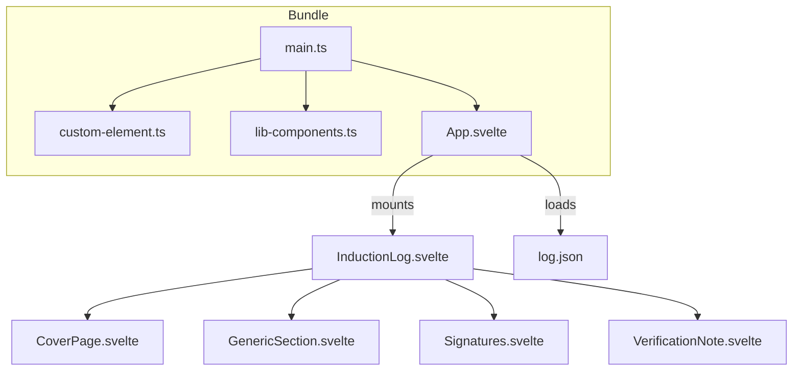
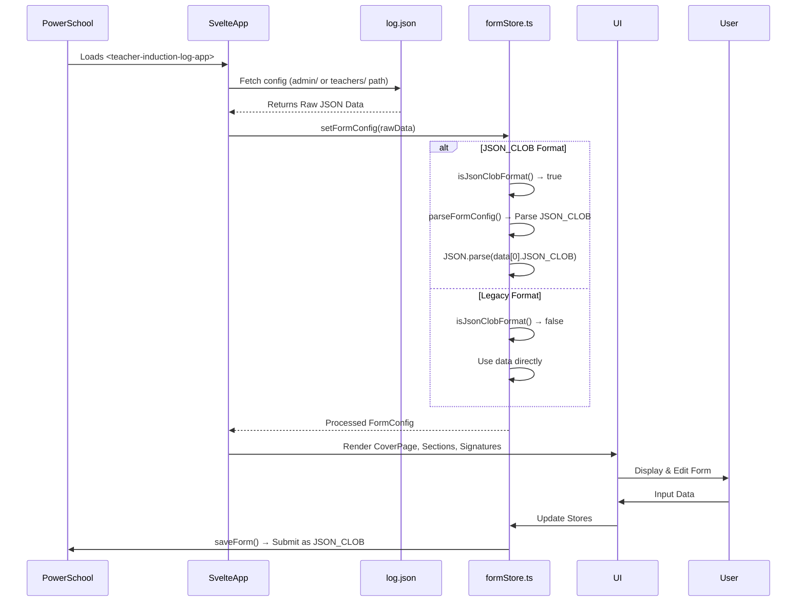

# Teacher Induction Log Plugin - Architecture & PowerSchool Integration

---

## PowerSchool Page Embedding

```mermaid
flowchart TD
    subgraph PowerSchool_Page
        A[~[wc:commonscripts]] --> B[~[wc:admin_header_frame_css]]
        B --> C[Breadcrumbs + Navigation]
        C --> D[~[wc:admin_navigation_frame_css]]
        D --> E[<teacher-induction-log-app>]
        E --> F[~[wc:admin_footer_frame_css]]
    end

    subgraph Svelte_App
        E --> G[teacher-induction-log-app (Custom Element)]
    end
```

- The plugin is embedded as `<teacher-induction-log-app>` inside a PowerSchool admin page.
- PowerSchool UI chrome is injected via `~[wc:*]` tags.
- **No `~[tlist_sql]` or `~(gpv.)` tags** are used in this plugin.

---

## Svelte App Bootstrap



- `main.ts` imports:
  - `custom-element.ts` (defines `<teacher-induction-log-app>`)
  - `lib-components.ts` (auto-registers all components as custom elements)
  - `App.svelte` (root component)
- `App.svelte` fetches JSON config and mounts `InductionLog.svelte`.
- `InductionLog.svelte` renders:
  - Cover page
  - Dynamic sections
  - Signatures
  - Verification note

---

## Data Flow



- The app **fetches JSON config** based on URL.
- **JSON_CLOB parsing** automatically handles both legacy and new data formats.
- The config drives **dynamic rendering** of form sections.
- User edits update Svelte stores.
- Form submission uses **JSON_CLOB format** for PowerSchool integration.

---

## JSON_CLOB Data Format

```mermaid
flowchart TD
    subgraph "PowerSchool Database"
        A[u_tesd_teacher_induction Table]
        A --> B[json_clob CLOB Field]
    end

    subgraph "JSON_CLOB Format"
        B --> C["[{\"JSON_CLOB\": \"{...escaped JSON...}\"}]"]
    end

    subgraph "Legacy Format"
        D["{\"inductee\": \"...\", \"building\": \"...\"}"]
    end

    subgraph "Parser Logic"
        E[isJsonClobFormat()] --> F{Array with JSON_CLOB?}
        F -->|Yes| G[Parse JSON_CLOB string]
        F -->|No| H[Use legacy format]
        G --> I[FormData Object]
        H --> I
    end

    C --> E
    D --> E
```

### JSON_CLOB Format Structure

**New Format (PowerSchool JSON_CLOB):**
```json
{
  "data": [
    {
      "JSON_CLOB": "{\"inductee\":\"Esther Tester\",\"building\":\"School Name\",\"assignment\":\"Mathematics\",\"mentorTeacher\":\"Jane Doe\",\"schoolYearOne\":\"2024-2025\",\"schoolYearTwo\":\"2025-2026\",\"summerAcademy\":[{\"day\":\"Day 1\",\"dateYearOne\":\"2024-08-15\",\"dateYearTwo\":\"\",\"verification\":\"BJK\"}],\"signatures\":{\"mentorTeacher\":\"\",\"buildingPrincipal\":\"\",\"superintendent\":\"\",\"date\":\"2025-06-10\"}}"
    }
  ]
}
```

**Legacy Format (Still Supported):**
```json
{
  "data": {
    "inductee": "Jane Smith",
    "building": "Elementary School",
    "assignment": "Mathematics",
    "mentorTeacher": "John Mentor",
    "schoolYearOne": "2024-2025",
    "schoolYearTwo": "2025-2026",
    "summerAcademy": [...],
    "signatures": {...}
  }
}
```

### Parser Features

- **Automatic Detection**: `isJsonClobFormat()` detects data format
- **Backward Compatibility**: Legacy format continues to work
- **Error Handling**: Graceful fallback if JSON_CLOB parsing fails
- **Type Safety**: Full TypeScript support with `JsonClobEntry` interface
- **PowerSchool Integration**: Works with `JSON_ARRAYAGG(JSON_OBJECT('JSON_CLOB' VALUE json_clob))` SQL

---

## Summary of PowerSchool PSHTML Tags

| Tag | Purpose |
|------------------------------|------------------------------|
| `~[wc:commonscripts]`        | Loads common PowerSchool JS |
| `~[wc:admin_header_frame_css]` | Admin header UI             |
| `~[wc:admin_navigation_frame_css]` | Admin navigation UI       |
| `~[wc:admin_footer_frame_css]` | Admin footer UI             |

**No** `~[tlist_sql]` or `~(gpv.)` tags are used in this plugin.

---

## Summary

- The plugin is a **Svelte app embedded as a custom element** in PowerSchool pages.
- It **loads JSON data** for form configuration and content.
- **JSON_CLOB format support** enables PowerSchool database integration with backward compatibility.
- The UI is **modular, data-driven, and role-aware**.
- PowerSchool integration is via **standard UI chrome and embedding**, **not via embedded SQL or global variables**.
- **Data persistence** uses PowerSchool's JSON_CLOB field format for seamless database storage.